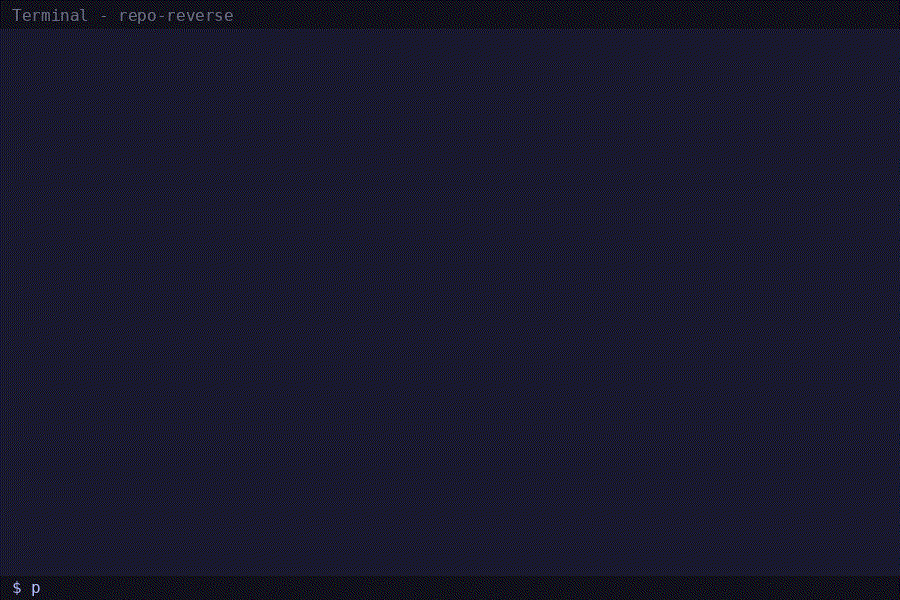

# 🔍 Repo Reverse

> 输入 GitHub 仓库地址 / 本地路径，自动还原成完整设计文档

[](https://opensource.org/licenses/MIT)
[](https://www.python.org/downloads/)

**Repo Reverse** 对任意代码仓库进行深度逆向工程，生成一份涵盖架构、模块、数据库、部署、Bug、安全、改进建议的完整 HTML 报告。

---

## Demo



---

## 输出内容

| 模块 | 说明 |
|------|------|
| 🏗 架构图 | 项目整体架构 + 设计模式识别 |
| 📦 模块关系图 | 模块间依赖关系，健康度评估 |
| 🔗 调用链图 | 关键运行时调用流程 |
| 🗄 数据库结构 | 实体、关系、ER 图 |
| 🚀 部署流程 | CI/CD 管道 + 基础设施拓扑 |
| 🐛 潜在 Bug | AI 检测的代码缺陷（按严重程度） |
| 🔒 安全问题 | 安全漏洞与修复建议 |
| 💡 改进建议 | 按投入/影响排名的优化方案 |
| 🔄 重写方案 | 「如果我重新设计这个项目...」 |

---

## 快速开始

### 1. 安装依赖

```bash
git clone https://github.com/xxxxxjr/repo-reverse.git
cd repo-reverse
pip install -r requirements.txt
```

### 2. （可选）设置 API Key

AI 深度分析需要 Anthropic API Key：

```bash
export ANTHROPIC_API_KEY=sk-ant-...
```

> 没有 Key 也能用，只是会跳过 Bug 检测、安全审计、改进建议和重写方案，只输出静态分析结果。

### 3. 运行

```bash
# 分析 GitHub 仓库
python cli.py https://github.com/tiangolo/fastapi

# 分析本地项目
python cli.py /path/to/your/project

# 指定输出文件
python cli.py https://github.com/tiangolo/fastapi -o fastapi-report.html

# 仅静态分析（无需 API Key）
python cli.py https://github.com/tiangolo/fastapi --no-ai
```

---

## 输出效果

打开生成的 HTML 文件，你会看到：

- 暗色主题 + 渐变标题的现代 UI
- 交互式 Mermaid 图表（可缩放、可拖拽）
- 按严重程度标注的 Bug 列表（High / Medium / Low）
- 按投入与影响排名的改进建议表
- 「如果让我重写」的替代架构提案

---

## 工作原理

```
GitHub URL / 本地目录
    │
    ▼
┌──────────────────────────┐
│ Phase 1: 仓库获取         │
│ - Clone / 读取本地目录    │
│ - 检测 README、技术栈     │
└──────────┬───────────────┘
           ▼
┌──────────────────────────┐
│ Phase 2: 静态分析         │
│ - 文件统计、语言分布       │
│ - 模块检测、依赖提取       │
│ - Import 图构建           │
│ - 入口点 / DB Schema 检测 │
└──────────┬───────────────┘
           ▼
┌──────────────────────────┐
│ Phase 3: AI 深度分析      │
│ - Claude API 分析代码库   │
│ - 架构模式识别            │
│ - Bug / Security 检测     │
│ - 改进建议 + 重写方案     │
└──────────┬───────────────┘
           ▼
┌──────────────────────────┐
│ Phase 4: 报告生成         │
│ - Mermaid 图表生成        │
│ - 精美 HTML 报告          │
└──────────────────────────┘
```

---

## 项目结构

```
repo-reverse/
├── cli.py                 # CLI 入口
├── requirements.txt       # Python 依赖
├── README.md
├── LICENSE
└── src/
    ├── fetcher.py          # GitHub 仓库克隆与元数据提取
    ├── static_analyzer.py  # 静态代码分析
    ├── ai_analyzer.py      # Claude API 驱动的深度分析
    ├── diagram_gen.py      # Mermaid 图表生成器
    └── report_gen.py       # HTML 报告生成器
```

---

## 依赖

- Python 3.10+
- [Anthropic Claude API](https://console.anthropic.com)（可选，用于 AI 分析）
- Git（用于克隆远程仓库）

---

## License

MIT © 2025
